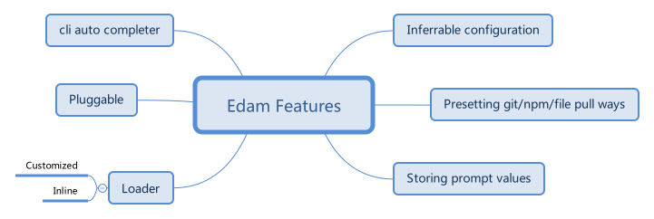

<style>
.post {
  max-width: 700px;
  margin: auto;
}
</style>

# 特性



## 可推理的配置

如 .babelrc 一般，edam 能够从 `process.cwd()` 寻找 edam 配置，并且依次向父亲寻找。（使用[cosmiconfig](https://github.com/davidtheclark/cosmiconfig)）。并且 json 文件支持注释等人性化语法（[JSON5](https://github.com/json5/json5)）

其中支持像 [`tsconfig.json`](http://www.typescriptlang.org/docs/handbook/tsconfig-json.html) 中的 extends 字段。

如

```text
// root/.edamrc
{
  alias: {
    react: 'facebook/react'
  },
  plugins: ['edam-plugin-dulcet-prompt']
}
// root/tpl/.edamrc
{
  extends: ['../.edamrc']
  alias: {
    edam: {
      type: 'git',
      url: 'imcuttle/edam',
      config: {
        output: "./here"
      }
      // 优先级更高，在 source 选中 edam 时候，config 会生效
      // 支持属性: cacheDir / output / plugins / storePrompts / pull
      // >= 2.1.0
    }
  }
}
// root/tpl/.edamrc 等同于
{
  alias: {
    edam: {
      type: 'git',
      url: 'imcuttle/edam',
      config: {
        output: "./he  ● inferrable-configuration walli check
re"
      }
    },
    react: 'facebook/react'
  },
  plugins: ['edam-plugin-dulcet-prompt']
}
```

## 支持三种模板来源

默认支持 `npm/git/file` 三种模板来源：

### `npm`

edam 将从 npm 中拉取模板，如我们可以直接在 cli 中指定来源为 `npm:edam@1.0.0`
或者在配置文件中写更明确的来源

```text
{
  source: {
    type: 'npm',
    url: 'edam',
    version: 'latest'
  }
}
```

### git

edam 还可以从远端 git 服务器拉取模板，如我们可以直接在 cli 中指定来源为 `github:imcuttle/cuttle?checkout=master`
或者在配置文件中写更明确的来源

```text
{
  source: {
    type: 'git',
    url: 'https://github.com/imcuttle/edam.git',
    // branch / commit SHA / tag
    checkout: 'master'
  }
}
```

### file

当然啦，edam 肯定是可以从本地文件拉取模板，直接指定来源为文件路径即可。

## 保持上一次的输入值

每次生成一份模板产物的时候，我们都需要去输入那些交互值，edam 会保存你上次输入值。而且你也可以使用 `yes` 去跳过哪些频繁的输入交互。

## 自定义 loader 与 内联 loader

模板开发者可以使用任意社区中的模板引擎，如官方提供的一个 loader: [edam-prettier-loader](https://github.com/imcuttle/edam/blob/master/packages/edam-prettier-loader/index.js)，用于美化文本。

## 可拔插

可以根据自己的需要，书写自己的插件，如[edam-plugin-dulcet-prompt](https://github.com/imcuttle/edam/blob/master/packages/edam-plugin-dulcet-prompt/index.js)

## 命令行自动补全

[edam-completer](https://github.com/imcuttle/edam/blob/master/packages/edam-completer/Readme.md)
